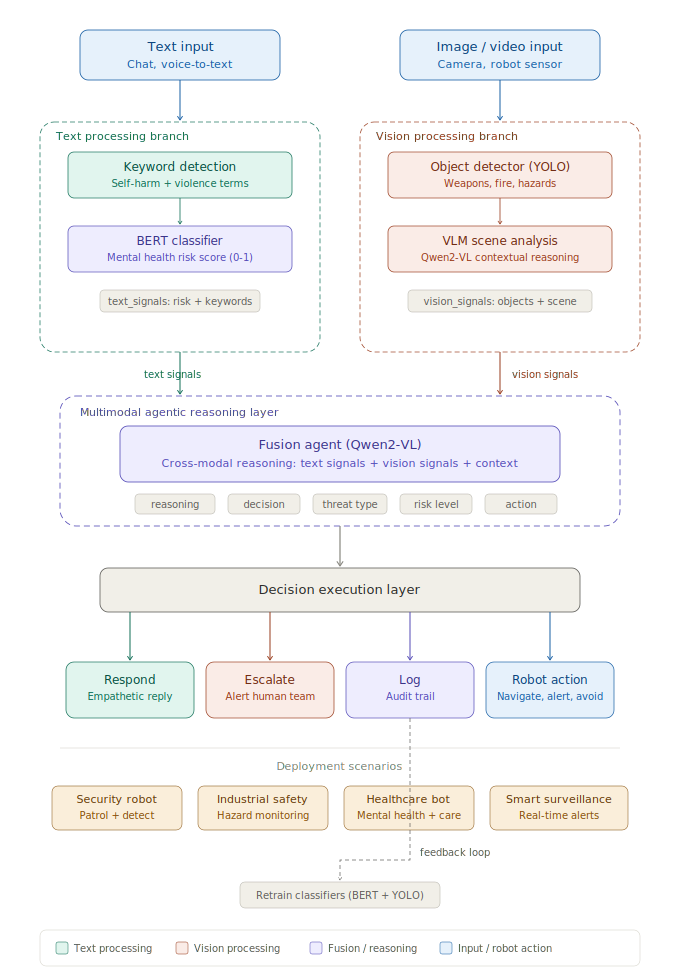

# MindGuard
Risk-Aware Agentic Reasoning with VLM for Physical and Mental Threat Detection Across Multimodal Signals


# MindGuard

**Risk-Aware Agentic Reasoning with VLM for Physical and Mental Threat Detection Across Multimodal Signals**

[](#)
[](https://rao-sanaullah.github.io/MindGuard/)
[](LICENSE)

<p align="center">
  
</p>

## Overview

MindGuard is a multimodal agentic pipeline that jointly detects **mental health crises** (suicidal ideation, emotional distress) and **physical threats** (weapons, violence, hazards) by reasoning across text and visual signals in real time. It fuses four detection layers — keyword matching, BERT classification, YOLO26 object detection, and VLM scene understanding — through an LLM-based reasoning agent that cross-validates signals across modalities.

**Key capability:** The system distinguishes figurative language from genuine danger. "I'm dying of laughter" + a smiling person = safe. "I'm fine" + a visible knife = escalate.

### Highlights

- **92.7% overall accuracy** on 150-scenario benchmark (vs 68.2% text-only, 67.9% vision-only)
- **3.6% false positive rate** — 4x lower than text-only baselines
- **1.6s end-to-end latency** — all models run locally, no cloud APIs
- **Autonomous monitoring** — background thread scans camera continuously without user input
- **100% open-source** — YOLO26, BERT, LLaVA-Phi3, Qwen2.5

## Pipeline Architecture

```
Text Input ─┬─► Keyword Detection ─┬──────────────────────┐
            └─► BERT Classifier ───┘                       │
                                                    Fusion Agent (LLM)──► Decision
Camera ────┬─► YOLO26 (real-time) ─┐                       │        ├── Safe
           └─► VLM Scene Analysis ─┴──────────────────────┘        ├── Monitor
                                                                    ├── Respond
               Autonomous Background Monitor ──────────────────────► ├── Alert
                    (scans every N seconds)                         └── Emergency
```

## Quick Start

### Prerequisites

- Python 3.10+
- NVIDIA GPU (for BERT + YOLO acceleration)
- [Ollama](https://ollama.com) installed and running
- USB camera (for live mode)

### Installation

```bash
# Clone the repository
git clone https://github.com/[your-username]/mindguard.git
cd mindguard

# Install dependencies
pip install torch transformers ultralytics opencv-python ollama flask

# Pull the required models via Ollama
ollama pull llava-phi3       # VLM for scene analysis (~2.2 GB)
ollama pull qwen2.5:3b       # Text LLM for fusion reasoning (~1.9 GB)

# Download YOLO26 (auto-downloads on first run)
# Place your fine-tuned BERT model in ./bert_model/
```

### Running MindGuard

**Terminal mode with live camera:**
```bash
# Interactive: type messages + live camera feed
QT_QPA_PLATFORM=xcb python robot.py --camera 0

# Headless: camera-only autonomous monitoring
python robot.py --camera 0 --headless --no-display

# Adjust scan interval (default: 5 seconds)
python robot.py --camera 0 --interval 3
```

**Web interface:**
```bash
python web_app.py --camera 0
# Open http://localhost:5000
```

**Run evaluation benchmark:**
```bash
# Quick test (30 scenarios)
python evaluate.py --quick

# Full evaluation (150 scenarios)
python evaluate.py

# Single category
python evaluate.py --category false_positive
```

## Project Structure

```
mindguard/
├── robot.py                 # Main pipeline — terminal + camera mode
├── web_app.py               # Flask web interface with live camera
├── evaluate.py              # Automated 150-scenario evaluation
├── test_scenarios.csv       # All test cases with expected outcomes
├── bert_model/              # Fine-tuned BERT classifier (user-provided)
├── web_static/
│   └── index.html           # Web UI frontend
├── docs/
│   ├── index.html           # Project webpage
│   ├── system_architecture.svg
│   └── figures/             # Example screenshots
├── results/
│   ├── evaluation_results.csv
│   └── summary_tables.txt
├── snapshots/               # Auto-saved threat snapshots
├── threat_alerts.csv        # Interaction log
├── escalations.csv          # Escalation log
└── README.md
```

## Models

| Component | Model | Size | Speed | Role |
|---|---|---|---|---|
| Text classifier | Fine-tuned BERT | ~400 MB | ~10 ms | Mental health risk score (0-1) |
| Object detector | YOLO26 nano | ~5 MB | ~8 ms | Real-time weapon/person detection |
| Scene analyzer | LLaVA-Phi3 | 2.2 GB | ~1.3 s | Contextual visual understanding |
| Fusion agent | Qwen2.5-3B | 1.9 GB | ~0.3 s | Cross-modal reasoning + decision |

## Evaluation Results

Tested on 150 curated scenarios across five categories:

| Category | Samples | Text-only | Vision-only | MindGuard |
|---|---|---|---|---|
| Safe conversation | 40 | 97.0% | 95.5% | **99.5%** |
| Mental health distress | 30 | 86.0% | 0.0% | **88.3%** |
| Physical threat | 25 | 0.0% | 88.0% | **90.0%** |
| Combined threats | 25 | 67.0% | 78.0% | **90.0%** |
| False positive rejection | 30 | 70.0% | 74.0% | **92.3%** |
| **Overall** | **150** | 68.2% | 67.9% | **92.7%** |

Full per-scenario results available in [`results/evaluation_results.csv`](results/evaluation_results.csv).

## Features

### Three Operating Modes

**Interactive mode** — Type messages in the terminal while the camera provides live visual context. The agent responds conversationally when safe and escalates when threats are detected.

**Web interface** — Browser-based dashboard with live camera feed, chat interface, real-time pipeline status panel, and session statistics.

**Headless mode** — No user interaction required. The autonomous monitor continuously scans the camera and triggers alerts when threats appear. Designed for unattended deployment.

### Autonomous Background Monitoring

A dedicated thread analyzes the camera feed every N seconds using YOLO + VLM, independent of user input. Visual threats (weapons, fire, aggressive behavior) are detected and flagged automatically with timestamped camera snapshots saved to the `snapshots/` directory.

### Cross-Modal False Positive Rejection

The fusion agent reduces false alarms by cross-validating text signals against visual context:

| Input text | Visual scene | Text-only | MindGuard |
|---|---|---|---|
| "I want to die laughing" | Person smiling | ESCALATE | **SAFE** |
| "This game is killing me" | Person at computer | ALERT | **SAFE** |
| "I'm fine" | Knife visible | SAFE | **MONITOR** |

### Self-Improving Feedback Loop

Every interaction is logged with full pipeline metadata — keyword flags, BERT scores, YOLO detections, VLM analysis, and agent decisions. These logs serve as labeled training data that can be used to periodically retrain BERT and fine-tune YOLO, improving accuracy over time.

## Edge Deployment

MindGuard is designed for deployment on edge hardware. All models run locally without cloud dependency.

| Platform | VRAM | Recommended models |
|---|---|---|
| Desktop GPU (8+ GB) | 8-24 GB | LLaVA-Phi3 + Qwen2.5:3b (default) |
| NVIDIA Jetson Orin AGX | 64 GB | LLaVA-Phi3 + Qwen2.5:7b |
| NVIDIA Jetson Orin NX | 16 GB | LLaVA-Phi3 + Qwen2.5:3b |
| CPU only | N/A | Fallback rule-based mode (no LLM) |

## Future Directions

- **Speech input** — Whisper integration for voice-based threat detection
- **ROS2 integration** — Deploy on mobile robots with Nav2 navigation
- **Temporal reasoning** — Track evolving situations across video frames
- **Multi-agent fleet** — Coordinated monitoring across multiple cameras/robots
- **Custom YOLO training** — Fine-tune on weapon-specific datasets for higher detection accuracy

## Citation

```bibtex
@inproceedings{mindguard2026,
  title={MindGuard: Risk-Aware Agentic Reasoning with VLM for Physical and Mental Threat Detection Across Multimodal Signals},
  author={[Author Names]},
  booktitle={AI4GOOD Workshop at the International Conference on Machine Learning (ICML)},
  year={2026},
  url={https://github.com/[your-username]/mindguard}
}
```

## License

This project is released under the [MIT License](LICENSE).

## Acknowledgments

[To be added]
